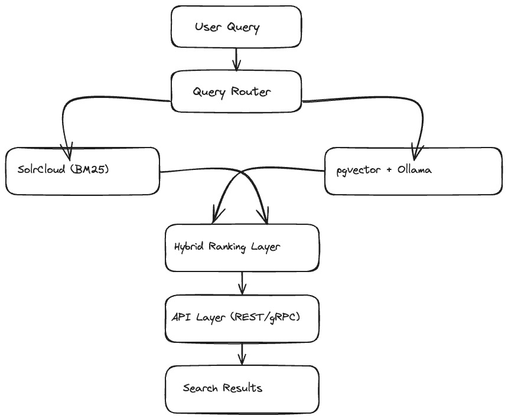

# **Hybrid Retrieval and Ranking Engine**

A modular search platform that combines lexical retrieval and semantic retrieval in one query path, with service boundaries designed for distributed deployment.

---

## **Table of Contents**

- [Project Overview](#project-overview)
- [System Layout](#system-layout)
- [Service Topology](#service-topology)
- [Current Status](#current-status)
- [Repository Structure](#repository-structure)
- [Installation](#installation)
- [Local Run](#local-run)
- [APIs (Current)](#apis-current)
- [Storage and Retrieval](#storage-and-retrieval)
- [Observability](#observability)
- [Benchmark Targets](#benchmark-targets)
- [Kubernetes Assets](#kubernetes-assets)
- [Roadmap Tracking](#roadmap-tracking)

---

## **Project Overview**

This project implements a hybrid search architecture with separate services for ingestion, indexing, query execution, vector retrieval, ranking, fusion, aggregation, caching, metadata, gateway routing, orchestration, and monitoring.

Core design choices in the codebase:

- Lexical retrieval path on **SolrCloud**.
- Semantic retrieval path on **PostgreSQL + pgvector** with **Ollama** as embedding provider.
- Hybrid merge/ranking kept in the application layer.
- Event-driven ingestion/indexing path using Kafka.
- Container-first runtime (`docker-compose.yaml`) and Kubernetes manifests (`k8s/`).

---

## **System Layout**



Execution model (high level):

1. Documents are ingested and published to Kafka.
2. Indexing service consumes events and updates lexical/storage layers.
3. Query service fans out to lexical and semantic services.
4. Ranking/fusion stages combine signals into final result payloads.
5. Gateway, caching, and monitoring services provide edge/runtime support.

---

## **Service Topology**

Application services (Maven modules):

- `ingestion-service`
- `indexing-service`
- `query-service`
- `vector-service`
- `ranking-service`
- `fusion-service`
- `aggregation-service`
- `caching-service`
- `metadata-service`
- `gateway-service`
- `monitoring-service`
- `orchestration-service`

Runtime dependencies present in deployment assets:

- Kafka (event transport)
- SolrCloud cluster services
- PostgreSQL (`pgvector` image)
- Redis
- Ollama

---

## **Current Status**

Implemented in repository:

- Multi-service project structure with per-service Dockerfiles and root multi-module Maven build.
- Query endpoint skeleton with Solr + vector fan-out.
- Vector service API surface and placeholder vector search response.
- Gateway global filter hook and fallback endpoint.
- Monitoring service with Prometheus exposure config and initial metric wiring.
- Kubernetes resources for SolrCloud stack, Postgres, Ollama, Redis, and core services.
- Observability assets for Prometheus/Grafana provisioning and alert rules.

Planned / in-progress (tracked in backlog docs):

- Production hybrid merge/ranking logic in query path.
- Real ANN retrieval implementation over `pgvector` + Ollama embeddings.
- Facets API, gRPC layer, JWT validation, richer metrics, persistence wiring, and benchmark guardrails.

---

## **Repository Structure**

Key top-level files and directories:

- `README.md` - architecture and runtime overview.
- `docker-compose.yaml` - local multi-service runtime.
- `k8s/` - Kubernetes manifests for services and stateful dependencies.
- `observability/` - Prometheus, Grafana, and alerting assets.

---

## **Installation**

Prerequisites:

- Java 17+
- Maven 3.9+
- Docker + Docker Compose
- Kubernetes (optional, `minikube`-first path)

Clone and build:

```bash
git clone https://github.com/Arup-Chauhan/Hybrid-Retrieval-and-Ranking-Engine.git Hybrid-Retrieval-and-Ranking-Engine
cd Hybrid-Retrieval-and-Ranking-Engine
mvn clean package
```

---

## **Local Run**

Start the stack:

```bash
docker-compose up --build
```

Run in background:

```bash
docker-compose up --build -d
```

Stop:

```bash
docker-compose down
```

---

## **APIs (Current)**

Endpoints currently visible in code:

- `POST /search` (query service)
  - File: `query-service/src/main/java/com/hybrid/query/controller/QueryController.java`
- `GET /api/vector/search` (vector service)
  - File: `vector-service/src/main/java/com/hybrid/vector/controller/VectorController.java`
- `POST /api/ingest` (ingestion service)
  - File: `ingestion-service/src/main/java/com/hybrid/ingestion/controller/IngestionController.java`
- `POST /api/rank` (ranking service)
  - File: `ranking-service/src/main/java/com/hybrid/ranking/controller/RankingController.java`
- `POST /api/fusion/combine` (fusion service)
  - File: `fusion-service/src/main/java/com/hybrid/fusion/controller/FusionController.java`

Example request (query service direct):

```bash
curl -X POST http://localhost:8083/search \
  -H "Content-Type: application/json" \
  -d '{"query":"wireless headphones"}'
```

---

## **Storage and Retrieval**

- Lexical index path: Solr collections.
- Semantic path: PostgreSQL + `pgvector`.
- Query result caching: Redis-backed cache service.
- Metadata path: metadata service + repository layer.

Schema intent (tracked in docs/backlog):

- Document metadata table.
- Vector metadata linkage.
- Query log table for latency/hit analysis.

---

## **Observability**

Checked-in assets:

- Prometheus scrape config: `observability/prometheus/prometheus.yml`
- Alert rules: `observability/alerts/hybrid-alert-rules.yml`
- Grafana datasource provisioning: `observability/grafana/datasources/prometheus-datasource.yaml`
- Grafana dashboard provisioning: `observability/grafana/dashboards/dashboards.yaml`
- Starter dashboard: `observability/grafana/dashboards/hybrid-overview.json`

Current implementation note:

- Basic metric wiring exists; full stage-level hybrid SLI coverage remains planned work.

---

## **Benchmark Targets**

Committed operating targets:

- Scale target: `500K` documents.
- Latency target: `p95 < 200ms` for hybrid search under defined load.

Performance guardrails and repeatable benchmark automation remain open work.

---

## **Kubernetes Assets**

Kubernetes resources are organized under `k8s/` for:

- SolrCloud services/stateful sets and collection init job.
- Postgres and extension bootstrap job.
- Ollama deployment and model pull job.
- Redis deployment/service.
- Core application service deployments/services.

Apply manifests:

```bash
kubectl apply -f k8s/
```

---

## **Roadmap Tracking**

Backlog and execution order are maintained internally and updated as implementation milestones are completed.
