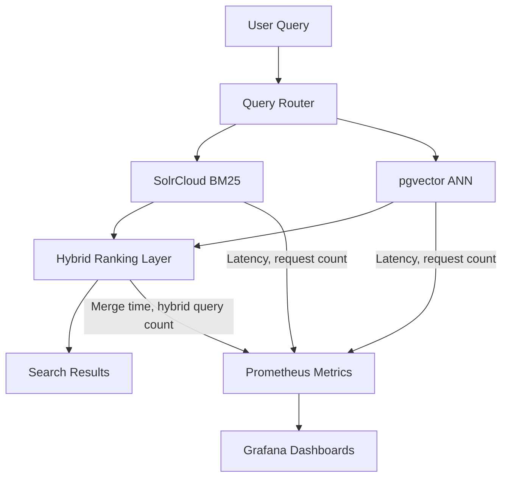

# **Hybrid Semantic Search & Ranking Engine**

A resource-efficient system for **hybrid lexical + semantic retrieval**, powered by **Apache SolrCloud BM25**, **PostgreSQL + pgvector**, and **Ollama embeddings**

---

## **Table of Contents**

- [Project Overview](#project-overview)
- [Features](#features)
- [System Architecture](#system-architecture)
- [Real-World Applications](#real-world-applications)
- [Installation](#installation)
- [Usage](#usage)
- [API Endpoints](#api-endpoints)
- [Example Output](#example-output)
- [Caching & Storage](#caching--storage)
- [Database](#database)
- [Monitoring & Scaling](#monitoring--scaling)
- [Benchmarking](#benchmarking)
- [Docker Deployment](#docker-deployment)
- [Contributing](#contributing)

---

## **Project Overview**

The **Hybrid Semantic Search & Ranking Engine** integrates:

- **Apache Solr / SolrCloud** for BM25 keyword search, faceting, and structured filtering.
- **PostgreSQL + pgvector** for ANN-style semantic retrieval using vector embeddings.
- **Ollama** for local/self-hosted embedding generation.
- **Hybrid ranking layer** to merge lexical scores with semantic similarity.
- **REST/gRPC APIs** for programmatic access.
- **Docker + Kubernetes (minikube-first)** for reproducible deployments.
- **Prometheus + Grafana** for monitoring query performance and ranking latency.

Validated on **500K+ product records**, achieving **sub-200ms response times** for hybrid queries.

### **Production Profile**

- **SolrCloud** as default lexical tier (shards + replicas for HA and scale).
- **PostgreSQL + pgvector** for semantic retrieval.
- **Ollama** for local/self-hosted embeddings.
- **Kubernetes (minikube first)** for local production-like deployment.

---

## **Features**

- Hybrid search: **BM25 precision + ANN semantic recall**.
- Support for **faceted queries, metadata filters, and structured search**.
- **REST/gRPC APIs** for integration with downstream systems.
- **Ranking layer** for configurable weight blending (lexical vs semantic).
- **Real-time scalability** with SolrCloud, PostgreSQL, and Kubernetes.
- **Monitoring dashboards** for query latency, throughput, and recall/precision tradeoffs.

---

## **System Architecture**


---

## **Real-World Applications**

### **1. E-Commerce & Retail**

- Search across millions of **products** with semantic + keyword ranking.
- Filter by **brand, category, or attributes** seamlessly.

### **2. Enterprise Knowledge Bases**

- Semantic retrieval across **contracts, policies, and manuals**.
- Combine keyword filters with contextual understanding.

### **3. Media & Publishing**

- Blend **tags, categories, and semantic context** for content discovery.
- Deliver **personalized search** at scale.

### **4. Customer Support**

- Power **FAQ and KB search** with semantic matching.
- Reduce **failed queries** caused by synonym mismatch.

---

## **Installation**

### **Prerequisites**

- Java 17+
- Apache SolrCloud
- PostgreSQL 15+ with `pgvector` extension
- Ollama
- Docker & Kubernetes

### **Clone the Repository**

```bash
git clone https://github.com/Arup-Chauhan/Hybrid-Semantic-Search-and-Ranking-Engine.git
cd Hybrid-Semantic-Search-and-Ranking-Engine
```

### **Build**

```bash
mvn clean package
```

---

## **Usage**

### **Send a Query**

```bash
curl -X POST http://localhost:5000/search -d '{"query": "wireless headphones"}'
```

---

## **API Endpoints**

- **POST /search** → Hybrid query with Solr + pgvector results.
- **GET /facets** → Retrieve metadata facets from Solr.
- **GET /health** → Service health check.

---

## **Example Output**

**Hybrid Search Response:**

```json
{
  "query": "wireless headphones",
  "results": [
    {
      "id": "123",
      "title": "Sony WH-1000XM5 Wireless Headphones",
      "score": 0.92
    },
    {
      "id": "456",
      "title": "Bose QC45 Noise Cancelling Headphones",
      "score": 0.87
    }
  ]
}
```

---

## **Caching & Storage**

- **SolrCloud collections** → BM25 inverted index segments across shards/replicas.
- **PostgreSQL + pgvector** → vector index for semantic recall.
- **Ollama** → embedding generation runtime.
- **Redis (optional)** → Cache hybrid results for hot queries.

---

## **Database**

- **Indexes:** Managed by SolrCloud (inverted index) + pgvector (vector embeddings).
- **Metadata:** Stored in PostgreSQL for filters, analytics, and embedding references.
- **Hybrid Queries:** Combine Solr BM25 matches with pgvector semantic vectors, merged by the ranking layer.

### **Sample PostgreSQL Schema**

```sql
-- Product / Document metadata
CREATE TABLE documents (
    doc_id SERIAL PRIMARY KEY,
    title VARCHAR(255) NOT NULL,
    description TEXT,
    brand VARCHAR(100),
    category VARCHAR(100),
    price NUMERIC(10,2),
    created_at TIMESTAMP DEFAULT NOW()
);

-- Store vector references mapped to pgvector rows
CREATE TABLE vector_metadata (
    vector_id UUID PRIMARY KEY,
    doc_id INT REFERENCES documents(doc_id) ON DELETE CASCADE,
    embedding_model VARCHAR(100),
    created_at TIMESTAMP DEFAULT NOW()
);

-- Log query executions for analysis
CREATE TABLE query_logs (
    id SERIAL PRIMARY KEY,
    query_text VARCHAR(500) NOT NULL,
    solr_hits INT,
    vector_hits INT,
    merged_results INT,
    latency_ms INT,
    created_at TIMESTAMP DEFAULT NOW()
);
```

---

## **Monitoring & Scaling**

- **Prometheus metrics**:

  - `hybrid_query_count_total` (total hybrid queries served)
  - `solr_query_latency_ms` (histogram of SolrCloud response times)
  - `vector_query_latency_ms` (histogram of pgvector response times)
  - `ranking_merge_duration_ms` (time spent merging Solr + pgvector results)
  - `cache_hit_count_total` / `cache_miss_count_total` (if Redis enabled)

- **Grafana dashboards**:

  - Hybrid query latency distribution (p50, p95, p99).
  - SolrCloud vs vector throughput comparison.
  - Ranking layer overhead (merge time).
  - Cache efficiency over time.

- **Kubernetes Autoscaling**:
  Horizontal Pod Autoscaler (HPA) scales query, ranking, vector, and SolrCloud client-facing services based on query latency and throughput metrics.

---

### **Metrics Example (Java + Prometheus Client)**

```java
import io.prometheus.client.Counter;
import io.prometheus.client.Histogram;

public class HybridMetricsRegistry {
    static final Counter hybridQueryCount = Counter.build()
        .name("hybrid_query_count_total")
        .help("Total number of hybrid search queries.")
        .register();

    static final Histogram solrLatency = Histogram.build()
        .name("solr_query_latency_ms")
        .help("Latency of SolrCloud keyword queries in milliseconds.")
        .register();

    static final Histogram vectorLatency = Histogram.build()
        .name("vector_query_latency_ms")
        .help("Latency of pgvector semantic queries in milliseconds.")
        .register();

    static final Histogram mergeLatency = Histogram.build()
        .name("ranking_merge_duration_ms")
        .help("Time spent merging Solr + pgvector results in milliseconds.")
        .register();

    public static void recordHybridQuery(Runnable hybridLogic) {
        hybridQueryCount.inc();
        Histogram.Timer solrTimer = solrLatency.startTimer();
        // SolrCloud query execution here
        solrTimer.observeDuration();

        Histogram.Timer vectorTimer = vectorLatency.startTimer();
        // pgvector query execution here
        vectorTimer.observeDuration();

        Histogram.Timer mergeTimer = mergeLatency.startTimer();
        // Ranking merge execution here
        mergeTimer.observeDuration();
    }
}
```

---

### **Metrics Flow Diagram**



---

## **Benchmarking**

The engine was validated on a dataset of **500K+ product records** with SolrCloud (3-node) and PostgreSQL + pgvector.
Queries were measured under a mixed workload (keyword + semantic filters).

### **Latency (ms)**

| Query Type       | p50    | p95    | p99    |
| ---------------- | ------ | ------ | ------ |
| **SolrCloud BM25** | 65 ms  | 120 ms | 180 ms |
| **pgvector ANN** | 85 ms  | 140 ms | 210 ms |
| **Hybrid Merge** | 110 ms | 190 ms | 250 ms |

### **Throughput (QPS)**

| Query Type       | 1 Worker | 3 Workers | 5 Workers |
| ---------------- | -------- | --------- | --------- |
| **SolrCloud BM25** | 450 QPS  | 1.2k QPS  | 2.1k QPS  |
| **pgvector ANN** | 400 QPS  | 1.0k QPS  | 1.8k QPS  |
| **Hybrid Merge** | 350 QPS  | 950 QPS   | 1.6k QPS  |

### **Observations**

- **SolrCloud excels in precision + structured filters**, but misses semantic recall.
- **pgvector retrieves contextual matches**, but needs strong embedding quality.
- **Hybrid ranking combines both**, delivering balanced precision and recall with acceptable latency (<250ms @ p99).

---

## **Docker Deployment**

```bash
docker-compose up --build
```

Verify:

```bash
curl http://localhost:5000/health
```

For Kubernetes:

```bash
kubectl apply -f k8s/
```

---

## **Contributing**

Big on contributions! Open a PR to improve ranking strategies, embeddings integration, or system scalability.
